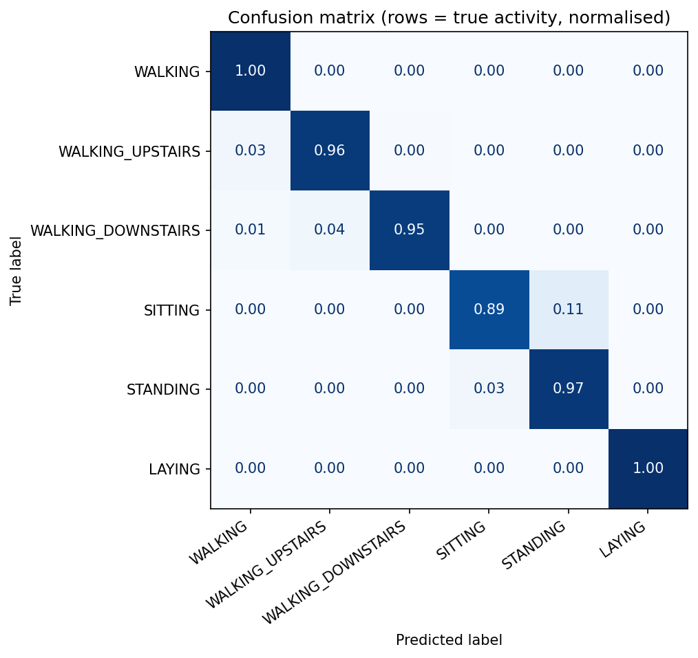
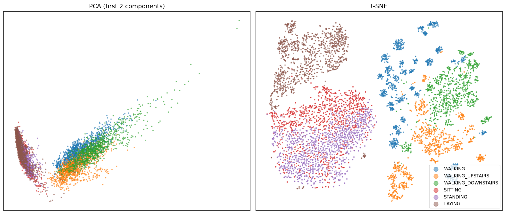
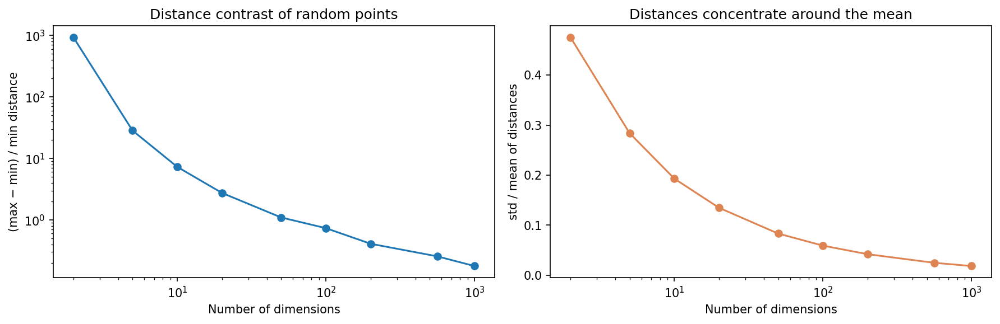
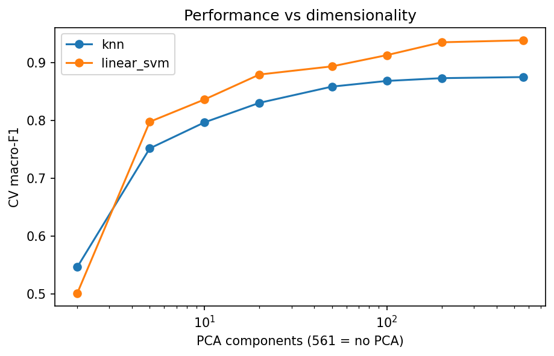
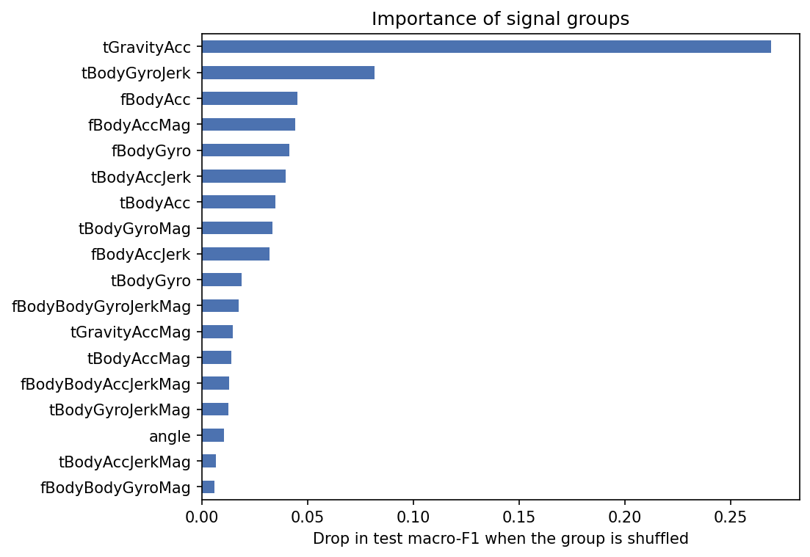

# Human Activity Recognition from Smartphone Sensors


Classifying six human activities (walking, walking upstairs, walking downstairs, sitting, standing, lying) from the **accelerometer and gyroscope** of a waist-worn smartphone, with a focus on **generalising to new people**.

📓 **Full analysis with outputs:** [`notebooks/har_analysis.ipynb`](notebooks/har_analysis.ipynb)

This is the same family of problems as **fall detection**: classifying short windows of body-worn inertial signals, where the model must work on people it has never seen.

## Results

| | Result |
|---|---|
| Final model | Linear SVM (C = 0.1) on 561 standardised features |
| Subject-level CV macro-F1 | 0.939 ± 0.035 |
| **Test accuracy / macro-F1 (9 unseen subjects)** | **96.2% / 0.962** |
| Worst / best test subject | 89.5% / 99.2% |

<p float="left">
  
  
</p>

## Key findings

**1. A random split overestimates accuracy by 6–8 percentage points.** Windows overlap by 50% and every person appears many times, so a random split tests the model on near-copies of training windows from the same person.

| Model | Random split (leaky) | Subject split (honest) | Optimism |
|---|---|---|---|
| RBF SVM | 98.8% | 93.1% | 5.6 pp |
| Random Forest | 98.2% | 90.8% | 7.5 pp |
| kNN | 96.0% | 87.7% | 8.2 pp |

All evaluation in this project uses **subject-level cross-validation** (`StratifiedGroupKFold`).

**2. Simple linear models beat complex ones.** With expert-engineered features, the classes are almost linearly separable, and flexible models mostly learn subject-specific patterns.

| Model | CV macro-F1 | Fit time |
|---|---|---|
| **Linear SVM** | **0.939 ± 0.035** | 0.6 s |
| Logistic Regression | 0.935 ± 0.034 | 0.9 s |
| RBF SVM | 0.930 ± 0.025 | 1.1 s |
| HistGradientBoosting | 0.924 ± 0.042 | 22 s |
| Random Forest | 0.903 ± 0.053 | 22 s |
| kNN | 0.875 ± 0.026 | 0.1 s |

**3. The curse of dimensionality depends on the data.** For random points, the contrast between the farthest and nearest pair falls from ~935 (2D) to 0.26 (561D). But the 561 real features are highly correlated: **26 PCA components explain 80% of the variance**. Because the intrinsic dimension is low, kNN only plateaus with more dimensions instead of failing.

<p float="left">
  
  
</p>

**4. Errors are physically meaningful.** 63% of test errors are **sitting ↔ standing**: both are static and upright, and a waist sensor sees only a small change in pelvis tilt. The most important signal group is **gravity acceleration** (body orientation); shuffling it drops macro-F1 by 0.27.



## What the notebook covers

1. Data exploration: class balance, windows per subject
2. Feature structure: 18 signal groups (time vs frequency domain, body vs gravity, accelerometer vs gyroscope)
3. 2D visualisation with PCA and t-SNE
4. Leakage experiment: random vs subject-level CV
5. Comparison of six models with subject-level CV
6. Curse of dimensionality: distance concentration, PCA explained variance, performance vs components
7. Hyperparameter tuning with `GridSearchCV` and grouped CV
8. Test evaluation: classification report, confusion matrix, per-subject accuracy
9. Error analysis: sitting vs standing
10. Sensor-group permutation importance

## Dataset

[UCI Human Activity Recognition Using Smartphones](https://archive.ics.uci.edu/dataset/240/human+activity+recognition+using+smartphones) (Anguita et al., 2013): 30 volunteers, smartphone on the waist, signals at 50 Hz, windows of 2.56 s with 50% overlap, 561 features per window. The official split is by subject: 21 subjects for training and 9 for testing. The data is downloaded automatically.

## How to run

```bash
git clone https://github.com/EhsanR47/human-activity-recognition.git
cd human-activity-recognition
python -m venv .venv && source .venv/bin/activate   # Windows: .venv\Scripts\activate
pip install -r requirements.txt

jupyter notebook notebooks/har_analysis.ipynb      # downloads the data automatically
pytest                                             # unit tests
```

## Project structure

```
human-activity-recognition/
├── notebooks/
│   └── har_analysis.ipynb   # full analysis with outputs
├── src/
│   ├── config.py            # paths, data sources, settings
│   ├── data.py              # download, loading, feature groups
│   ├── models.py            # six model pipelines, PCA wrapper
│   ├── evaluation.py        # CV comparison, confusion matrix, per-subject accuracy, group importance
│   └── dimensionality.py    # distance-concentration experiment
├── tests/                   # unit tests (run in GitHub Actions)
├── reports/                 # CV results, classification report, figures
└── data/raw/                # dataset (not tracked by git)
```

## Limitations and next steps

- The 561 features are hand-crafted by the dataset authors. A natural next step is to learn features directly from the **raw signals** with a 1D-CNN.
- Each 2.56 s window is classified independently. **Temporal smoothing** over consecutive windows would likely fix many isolated sitting/standing errors.
- One device, one sensor position and 30 young adult volunteers. Generalisation to other devices, positions and older people (the main target group for fall detection) is not tested.

## Tech stack

Python, pandas, NumPy, scikit-learn, SciPy, matplotlib, Jupyter, pytest, GitHub Actions
